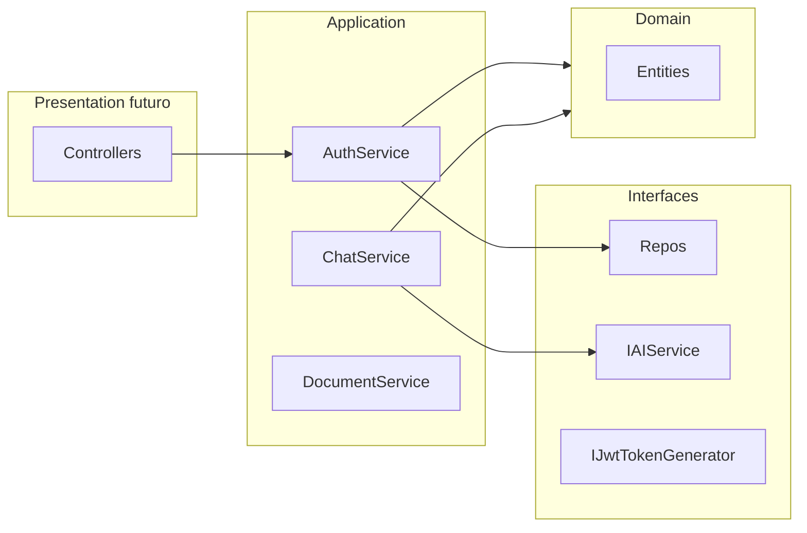

# Plan: Capa Application (Services, no UseCases)

## Contexto

- Domain ya implementado en [backend/Domain](backend/Domain) con namespace `JurisApp.Domain`.
- Application actual: solo referencia a Domain, placeholder [Class1.cs](backend/Application/Class1.cs), namespace `Appalication`.
- Target: `net10.0` (mismo que Domain). Build puede fallar si el SDK local no soporta net10 (reportar sin cambiar TF).

## Ajustes respecto al spec del usuario (alineación con Domain real)

El spec menciona `Purpose` / `Rules` en CustomSkill DTOs; la entidad real en [CustomSkill.cs](backend/Domain/Entities/CustomSkill.cs) usa:


| Domain         | Usar en DTOs / requests        |
| -------------- | ------------------------------ |
| `Name`         | `Name`                         |
| `WhenToUse`    | `WhenToUse`                    |
| `Instructions` | `Instructions`                 |
| `Examples`     | `Examples`                     |
| `RedFlags`     | `RedFlags`                     |
| `OutputFormat` | `OutputFormat`                 |
| `IsActive`     | `IsActive` en `CustomSkillDto` |


Constructor: `CustomSkill(Guid id, Guid lawyerProfileId, string name, string whenToUse, string instructions, string examples, string redFlags, string outputFormat)`

Update: `Update(name, whenToUse, instructions, examples, redFlags, outputFormat)`

Chat skills: `Chat.ApplySkill(customSkillId)` / `Chat.RemoveSkill(customSkillId)` — no duplicar lógica en el service más allá de cargar chat y llamar dominio.

## Namespace y limpieza

- Usar `**JurisApp.Application**` (subespacios: `.Common`, `.DTOs.*`, `.Interfaces.*`, `.Services`, `.Mappings`).
- `<RootNamespace>JurisApp.Application</RootNamespace>` en [Application.csproj](backend/Application/Application.csproj).
- Eliminar [Class1.cs](backend/Application/Class1.cs).

## Estructura de archivos (~70 archivos)

```
Application/
├── Common/           Result, Error, PagedResult
├── DTOs/             (según spec + Plans PlanDto/SubscriptionDto)
├── Interfaces/
│   ├── Persistence/  12 repos + IUnitOfWork
│   ├── Auth/         3 interfaces
│   ├── AI/           IAIService + DocumentAnalysisResult
│   └── Files/        IFileStorageService
├── Services/
│   ├── Interfaces/   7 interfaces
│   └──             7 implementaciones
├── Mappings/         7 archivos extension methods
└── DependencyInjection.cs
```

**No crear:** `UseCases/`, DbContext, Controllers, implementaciones de repos, MediatR, FluentValidation.

## 1. Common — Result pattern

[Common/Result.cs](backend/Application/Common/Result.cs): `Result` / `Result<T>` con `Success()`, `Failure(Error)`, `IsSuccess`, `Error`, `Value` (nullable en failure).

[Common/Error.cs](backend/Application/Common/Error.cs): `Code`, `Message`, `None`, factories `NotFound`, `Validation`, `Unauthorized`, `Conflict`.

[Common/PagedResult.cs](backend/Application/Common/PagedResult.cs): `Items`, `Page`, `PageSize`, `TotalCount`, `TotalPages` (calcular `TotalPages` en ctor o propiedad derivada).

## 2. DTOs

Todos en `JurisApp.Application.DTOs.{Area}`, sin lógica, sin `PasswordHash`.

**Auth:** `RegisterRequest`, `LoginRequest`, `AuthResponse` (Token + UserDto).

**Users:** `UserDto` (Id, FirstName, LastName, Email, `UserRole`), `CurrentUserDto`.

**LawyerProfiles:** DTOs del spec + `UpdateLawyerProfileRequest` (archivo listo; sin método de servicio en MVP salvo que se agregue después).

**Plans:** `PlanDto` (Id, Name, `PlanType`, Price, LimitsJson), `SubscriptionDto` (Id, UserId, PlanId, StartDate, EndDate?, `SubscriptionStatus`) — sin servicio en MVP.

**Chats / Folders / Documents / CustomSkills / AITasks:** según spec, con campos Domain corregidos en CustomSkills (ver tabla arriba).

**UploadDocumentRequest:** `Stream FileStream` — válido en Application; Presentation adaptará `IFormFile` a Stream.

## 3. Interfaces de persistencia

Ubicación: `JurisApp.Application.Interfaces.Persistence`.

Métodos exactamente como pide el usuario, tipos de retorno con entidades `JurisApp.Domain.Entities.`*.

Notas de implementación futura (Infrastructure):

- `ICustomSkillRepository.GetActiveByChatIdAsync`: join `ChatCustomSkill` + `CustomSkill` donde `IsActive == true`.
- `IChatRepository.GetByIdAsync`: opcionalmente incluir `AppliedSkills` para `ApplySkill`/`RemoveSkill` sin round-trip extra (no obligatorio en contrato).

`IPlanRepository.GetByTypeAsync(PlanType)` — incluir (existe `PlanType` en Domain).

## 4. Interfaces externas


| Área  | Archivo                                                        | Contrato clave                           |
| ----- | -------------------------------------------------------------- | ---------------------------------------- |
| Auth  | `IPasswordHasher`, `IJwtTokenGenerator`, `ICurrentUserService` | `GenerateToken(User user)`               |
| AI    | `IAIService`, `DocumentAnalysisResult`                         | Skills como `IReadOnlyList<CustomSkill>` |
| Files | `IFileStorageService`                                          | `SaveFileAsync` → URL string             |


## 5. Services — constructores y dependencias

Cada service: constructor con interfaces inyectadas + `IUnitOfWork`. Retornos `Task<Result<T>>` o `Task<Result>`.




### AuthService

- `RegisterAsync`: validar campos; `EmailExistsAsync` → `Conflict`; `new User(Guid.NewGuid(), ..., hash, UserRole.User)`; `AddAsync` + `SaveChangesAsync`; token + `ToDto()`.
- `LoginAsync`: buscar por email; `VerifyPassword`; si falla `Unauthorized`; token + DTO.

### LawyerProfileService

- `CreateAsync`: user existe; sin perfil previo → `Conflict`; `new LawyerProfile(Guid.NewGuid(), userId, ...)`; `user.UpgradeToLawyer()`; `Update(user)`; `AddAsync(profile)`; save.
- `VerifyAsync`: perfil por `LawyerProfileId`; `profile.Verify(VerifiedById)`; `Update`; save.
- `GetByUserIdAsync`: `GetByUserIdAsync` repo → `NotFound` si null.

### ChatService

- Helper privado `EnsureChatOwnership(chat, userId)` → `Unauthorized` si `chat.UserId != userId`.
- `CreateAsync`: user existe; si `FolderId` → `IFolderRepository.GetByIdAsync` + validar `folder.LawyerProfileId` pertenece al `LawyerProfile` del `userId` (vía `ILawyerProfileRepository.GetByUserIdAsync`).
- `new Chat(Guid.NewGuid(), userId, title)`; si `FolderId`, `AssignToFolder(folderId)`.
- `SendMessageAsync`: ownership; `new Message(..., MessageRole.User, content)`; mensajes previos `IMessageRepository.GetByChatIdAsync`; skills `GetActiveByChatIdAsync`; `IAIService.SendChatMessageAsync`; `new Message(..., Assistant, aiReply)`; dos `AddAsync`; save; devolver DTO del mensaje assistant.
- `GetByIdAsync`: chat + mensajes para `ToDto(chat, messages)`.
- `GetByUserIdAsync`: summaries con `ToSummaryDto` (`CreatedAt` de `BaseEntity`).
- `DeleteAsync`: ownership; `Delete(chat)`; save.

### DocumentService

- `UploadAsync`: ownership del chat; validar folder si aplica (misma regla lawyer); `IFileStorageService.SaveFileAsync`; `new Document(Guid.NewGuid(), chatId, title, url, folderId)`; save.
- `AnalyzeAsync`: document + chat ownership; skills activas del chat; si ya existe análisis → `Conflict`; `IAIService.AnalyzeDocumentAsync`; `new DocumentAnalysis(Guid.NewGuid(), documentId, summary, risks, recs, refs, type)`; save.
- `GetByChatIdAsync`: ownership + lista DTOs.

### CustomSkillService

- Helper `EnsureLawyerProfileOwnership(lawyerProfileId, userId)` vía `GetByUserIdAsync` comparando IDs.
- `CreateAsync`: ownership del `LawyerProfileId`; `new CustomSkill(Guid.NewGuid(), ...)` con todos los campos del request.
- `UpdateAsync`: skill existe + ownership; `skill.Update(...)`.
- `GetByLawyerProfileIdAsync`: ownership + map lista.
- `ApplyToChatAsync` / `RemoveFromChatAsync`: chat ownership + skill ownership; cargar chat; `ApplySkill` / `RemoveSkill`; `Update(chat)`; save.
- `DeleteAsync`: ownership; `Deactivate()` o `Delete` según política MVP — usar `Deactivate()` + `Update` o `Delete` del repo (plan: `Deactivate()` soft + `Update` para MVP simple, o `Delete` hard si se prefiere spec "DeleteAsync" — usar `**Delete` del repositorio** tras validar ownership).

### FolderService

- `CreateAsync`: `LawyerProfile` por userId requerido; `new Folder(Guid.NewGuid(), profile.Id, name, legalContext)`.
- `GetByUserIdAsync`: carpetas por `lawyerProfileId`.
- `DeleteAsync`: folder existe y `LawyerProfile.UserId == userId`.

### AITaskService

- `CreateAsync`: ownership chat; `CreateTaskPlanAsync(description)`; `new AITask(Guid.NewGuid(), chatId, description, plan)`.
- `CompleteAsync`: task + chat ownership; `MarkAsCompleted(result)`.
- `GetByChatIdAsync`: ownership + lista.

## 6. Mappings (extension methods estáticos)


| Archivo                 | Métodos                                                               |
| ----------------------- | --------------------------------------------------------------------- |
| `UserMappings`          | `ToDto`, `ToCurrentUserDto`                                           |
| `LawyerProfileMappings` | `ToDto`                                                               |
| `ChatMappings`          | `ToDto(Chat, IEnumerable<Message>)`, `ToSummaryDto`, `ToDto(Message)` |
| `DocumentMappings`      | `ToDto(Document)`, `ToDto(DocumentAnalysis)`                          |
| `CustomSkillMappings`   | `ToDto` (todos los campos Domain)                                     |
| `FolderMappings`        | `ToDto`                                                               |
| `AITaskMappings`        | `ToDto`                                                               |


## 7. DependencyInjection

Archivo [DependencyInjection.cs](backend/Application/DependencyInjection.cs):

```csharp
public static IServiceCollection AddApplication(this IServiceCollection services)
{
    services.AddScoped<IAuthService, AuthService>();
    // ... resto scoped
    return services;
}
```

**Paquete necesario:** `Microsoft.Extensions.DependencyInjection.Abstractions` (versión 10.x alineada a net10). Sin este paquete, `IServiceCollection` no compila en un class library. Es el único paquete propuesto; no es MediatR ni FluentValidation. Al implementar: agregar PackageReference o reportar si el usuario prefiere registro manual en Presentation.

Presentation llamará `services.AddApplication()` en `Program.cs` (fuera de alcance de este plan).

## 8. Validaciones y seguridad (en services)

Validaciones inline: `string.IsNullOrWhiteSpace`, `Guid.Empty`, entidad null → `Error.NotFound`, ownership → `Error.Unauthorized`, duplicados → `Error.Conflict`.

Recursos con ownership obligatorio: Chat, Document, CustomSkill, Folder, AITask.

## 9. Verificación final

- `dotnet build backend/Application/Application.csproj`
- Grep: sin `UseCases`, sin `EntityFrameworkCore`, sin referencia a Infrastructure/Presentation
- Ningún DTO con `PasswordHash`
- Sin carpeta UseCases ni clases `*UseCase`

## Orden de implementación

1. Common + actualizar csproj (RootNamespace; paquete DI Abstractions)
2. DTOs (todas las carpetas)
3. Interfaces (Persistence, Auth, AI, Files)
4. Mappings
5. Service interfaces + implementaciones (Auth → … → AITask)
6. DependencyInjection
7. Eliminar Class1.cs + build

## Fuera de alcance

- Implementaciones Infrastructure (EF, JWT, bcrypt, S3, OpenAI)
- `IPlanService` / suscripciones en registro (solo DTOs Plans)
- FluentValidation, MediatR, AutoMapper
- Extracción PDF real
- Controllers y DbContext

