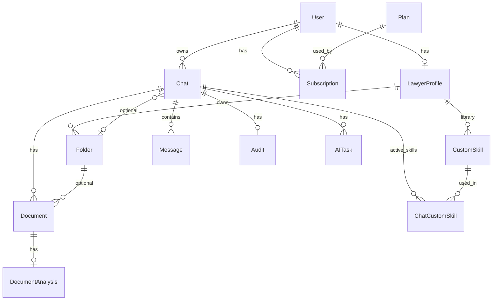

# Plan: Capa Domain (Clean Architecture)

## Contexto actual

- Proyecto: [backend/Domain/Domain.csproj](backend/Domain/Domain.csproj) — `net10.0`, nullable enabled, **sin paquetes ni referencias**.
- Placeholder a eliminar: [backend/Domain/Class1.cs](backend/Domain/Class1.cs).
- Convención: **`JurisApp.Domain`**, **`JurisApp.Domain.Common`**, **`JurisApp.Domain.Entities`**, **`JurisApp.Domain.Enums`**.

## Custom Skills — biblioteca + contexto de chat

**Objetivo de producto:** el abogado define skills reutilizables (estilo Claude) y las activa en una **conversación**. El input puede ser:

- un **documento** subido al chat (`Document` + eventual `DocumentAnalysis`), o
- **texto pegado** en un `Message`,

pero en ambos casos la IA debe usar las **mismas skills activas del chat**. Eso se resuelve en Application leyendo texto del documento o del mensaje; en Domain el anclaje es **`Chat`**, no `DocumentAnalysis`.

**Por qué Chat y no DocumentAnalysis**

| Escenario | Con skills solo en `DocumentAnalysis` | Con skills en `Chat` |
|-----------|----------------------------------------|----------------------|
| Pega cláusula en el chat | No hay `DocumentAnalysis` → skills no aplican | Skills del chat aplican |
| Sube PDF al mismo chat | Funciona | Funciona |
| Mismo chat, varios mensajes/docs | Skills hay que re-aplicar por análisis | Un solo conjunto activo por sesión |

`Document` ya exige `ChatId` en el modelo: todo documento vive en un chat. Unir skills al chat es coherente con el agregado real de trabajo con IA.

**Tres capas en el modelo**

| Capa | Entidad | Rol |
|------|---------|-----|
| Biblioteca | `CustomSkill` | Definición persistente del abogado (`LawyerProfileId`) |
| Contexto de sesión | `Chat` + `ChatCustomSkill` | Skills **activas** en esta conversación |
| Resultado estructurado | `DocumentAnalysis` | Salida persistida (summary, risks, etc.) **sin** FK a skills |

**Flujo en Application (fuera de Domain, documentado aquí como guía)**

1. Usuario abre chat y activa skills → `Chat.ApplySkill(...)`.
2. Usuario envía mensaje o sube documento.
3. Servicio de IA arma el prompt con: skills activas del chat + texto (de `Message.Content` o texto extraído del `Document`).
4. Si hay análisis formal de documento, persiste `DocumentAnalysis`; las skills usadas ya están en `Chat.AppliedSkills`.

## Estructura de archivos a crear

```
backend/Domain/
├── Common/BaseEntity.cs
├── Enums/          (7 archivos)
└── Entities/       (13 archivos)
    ├── User.cs
    ├── LawyerProfile.cs
    ├── Plan.cs
    ├── Subscription.cs
    ├── Chat.cs
    ├── ChatCustomSkill.cs      ← uso en conversación (reemplaza DocumentAnalysisCustomSkill)
    ├── Message.cs
    ├── Audit.cs
    ├── AITask.cs
    ├── Folder.cs
    ├── Document.cs
    ├── DocumentAnalysis.cs
    └── CustomSkill.cs
```

Eliminar `Class1.cs` tras crear los archivos reales.

## BaseEntity

Archivo: [backend/Domain/Common/BaseEntity.cs](backend/Domain/Common/BaseEntity.cs)

```csharp
public abstract class BaseEntity
{
    public Guid Id { get; protected set; }
    public DateTime CreatedAt { get; protected set; }
    public DateTime UpdatedAt { get; protected set; }

    protected BaseEntity() { } // EF Core

    protected BaseEntity(Guid id)
    {
        Id = id;
        var now = DateTime.UtcNow;
        CreatedAt = now;
        UpdatedAt = now;
    }

    protected void Touch() => UpdatedAt = DateTime.UtcNow;
}
```

## Enums (7 archivos)

| Archivo | Valores |
|---------|---------|
| `UserRole.cs` | User, Lawyer, Admin |
| `PlanType.cs` | Free, Pro, Max |
| `SubscriptionStatus.cs` | Active, Cancelled, Expired |
| `LawyerVerificationStatus.cs` | NotSubmitted, Pending, Verified, Rejected |
| `AITaskStatus.cs` | Pending, InProgress, Completed, Failed, Cancelled |
| `MessageRole.cs` | User, Assistant, System |
| `DocumentAnalysisType.cs` | Summary, RiskAnalysis, ContractReview, Custom |

## Modelo de relaciones



## Entidades y comportamiento

### 1. [User.cs](backend/Domain/Entities/User.cs)

- `FirstName`, `LastName`, `Email`, `PasswordHash`, `Role`.
- `Chats`, `Subscriptions`, `LawyerProfile?`.
- **`UpgradeToLawyer()`**, **`ChangeRole(UserRole role)`**.

### 2. [LawyerProfile.cs](backend/Domain/Entities/LawyerProfile.cs)

- Datos profesionales y verificación (sin cambios).
- Colecciones: **`Folders`**, **`CustomSkills`** (biblioteca).
- **`Verify`**, **`RejectVerification`**, **`MarkAsPendingVerification`**.

### 3–4. [Plan.cs](backend/Domain/Entities/Plan.cs), [Subscription.cs](backend/Domain/Entities/Subscription.cs)

- Sin cambios respecto al plan base (`Cancel`, `Expire`, `IsActive`).

### 5. [Chat.cs](backend/Domain/Entities/Chat.cs) — **contexto de skills**

- `UserId`, `Title`, `FolderId?`.
- Colecciones: `Messages`, `Documents`, `Tasks`, **`AppliedSkills`** (`ICollection<ChatCustomSkill>`), `Audit?`.
- **`AssignToFolder(Guid? folderId)`**.
- **`ApplySkill(Guid customSkillId)`**: agrega `ChatCustomSkill` si no existe el par `(ChatId, CustomSkillId)`; `Touch()`.
- **`RemoveSkill(Guid customSkillId)`**: quita la entrada de `AppliedSkills`; `Touch()`.

### 6. [ChatCustomSkill.cs](backend/Domain/Entities/ChatCustomSkill.cs) — uso en conversación

- `ChatId`, `CustomSkillId`, `AppliedAt` (`UtcNow` en ctor).
- Navegaciones: `Chat`, `CustomSkill`.
- No duplica instrucciones; solo referencia a la biblioteca.
- Invariante: un par `(ChatId, CustomSkillId)` único (enforced en `Chat.ApplySkill`).

### 7. [Message.cs](backend/Domain/Entities/Message.cs)

- `ChatId`, `Date`, `Role`, `Content` — canal principal de **texto pegado**; las skills vienen del chat padre.

### 8–9. [Audit.cs](backend/Domain/Entities/Audit.cs), [AITask.cs](backend/Domain/Entities/AITask.cs)

- Sin cambios. `AITask` puede consumir el mismo contexto de chat en Application.

### 10. [Folder.cs](backend/Domain/Entities/Folder.cs)

- Sin cambios.

### 11. [Document.cs](backend/Domain/Entities/Document.cs)

- `ChatId` obligatorio — garantiza que todo documento está en un chat con skills activas.

### 12. [DocumentAnalysis.cs](backend/Domain/Entities/DocumentAnalysis.cs)

- `DocumentId`, `Summary`, `Risks`, `Recommendations`, `References`, `DocumentAnalysisType Type`.
- **Sin** relación a `CustomSkill` ni `ChatCustomSkill`.
- Solo persiste el **resultado** del análisis; qué skills influyeron se infiere del chat al momento de ejecutar (o se audita en `Audit` / logs en Infrastructure si hace falta después).

### 13. [CustomSkill.cs](backend/Domain/Entities/CustomSkill.cs) — biblioteca del abogado

| Propiedad | Propósito |
|-----------|-----------|
| `LawyerProfileId` | Dueño |
| `Name` | Identificador corto |
| `WhenToUse` | Cuándo usarla |
| `Instructions` | Instrucciones para la IA |
| `Examples` | Ejemplos opcionales |
| `RedFlags` | Alertas / riesgos |
| `OutputFormat` | Formato de salida |
| `IsActive` | Disponible en biblioteca |

Navegaciones: `LawyerProfile`, `ChatCustomSkill` (usos en chats).

Métodos: **`Activate()`**, **`Deactivate()`**, **`Update(...)`**.

## Decisiones de diseño (acotadas)

| Tema | Decisión |
|------|----------|
| Biblioteca | `CustomSkill` → `LawyerProfile` |
| Uso activo | `ChatCustomSkill` → `Chat` (no `DocumentAnalysis`) |
| Documento vs texto | Mismo chat, mismas skills; Application unifica la fuente de texto |
| `DocumentAnalysis` | Solo output estructurado, desacoplado de skills |
| Validar ownership | Application: skill del `LawyerProfile` del usuario dueño del chat |
| `AITask` | Reutiliza skills del `Chat` padre en Application (sin entidad extra en Domain por ahora) |

## Orden de implementación

1. `BaseEntity` + enums.
2. `Plan`.
3. `User`, `LawyerProfile`, `Subscription`.
4. `CustomSkill`.
5. `Chat`, **`ChatCustomSkill`**, `Message`, `Audit`, `AITask`, `Folder`.
6. `Document`, `DocumentAnalysis`.
7. Eliminar `Class1.cs`.
8. `dotnet build backend/Domain/Domain.csproj`.

## Fuera de alcance (explícito)

- DbContext, EF, migraciones, repositorios, DTOs, servicios, controllers.
- Extracción de texto de PDF, prompts, elección documento vs mensaje (Application).
- Skills por carpeta/proyecto por defecto (iteración futura en `Folder` si hace falta).

## Verificación

```powershell
dotnet build e:\JurisApp\JurisApp\backend\Domain\Domain.csproj
```
